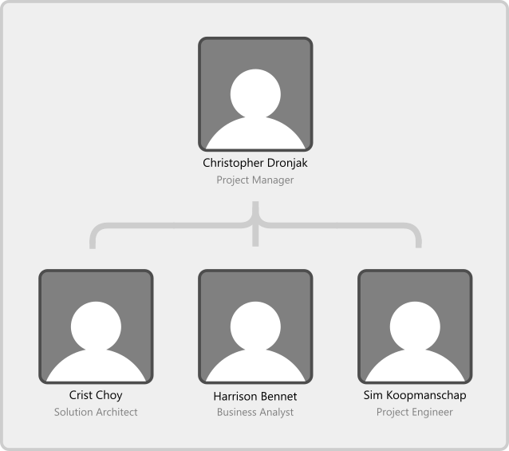

<!-- PROJECT LOGO -->
 

  

  <h3 align="center">FirstClass Interior</h3>

## About the project

This project is a website for Captivate Interior

    Home page: It should showcase its all-recent projects to attract more customers. All the projects must arrange according to their different categories.
    Contact page: It should give their contact details like address, contact number, fax number, and email id. This page should also include one form to receive any message from their users. The form should include the fields like name, email, subject, and message along with one button to submit their message.
    About Page: This page should contain information about their company. This should include their establishment year and staff members.
    Shop Page: This page should contain the images of items along with the price which they are selling.
    There should be one horizontal navigation bar on every page so that it should be easy for users to switch between all the pages.

## Company purpose

The purpose of our compnay is to develope software solutions for clients to thei9r satisfaction. Working with them to help achieve their goals and visions.

## Credits

